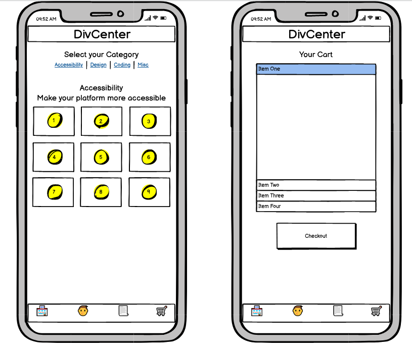
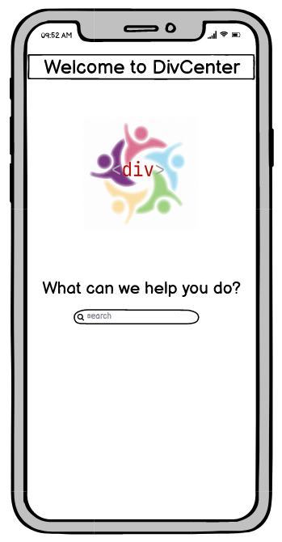
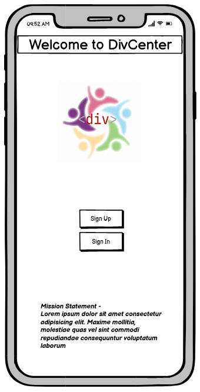
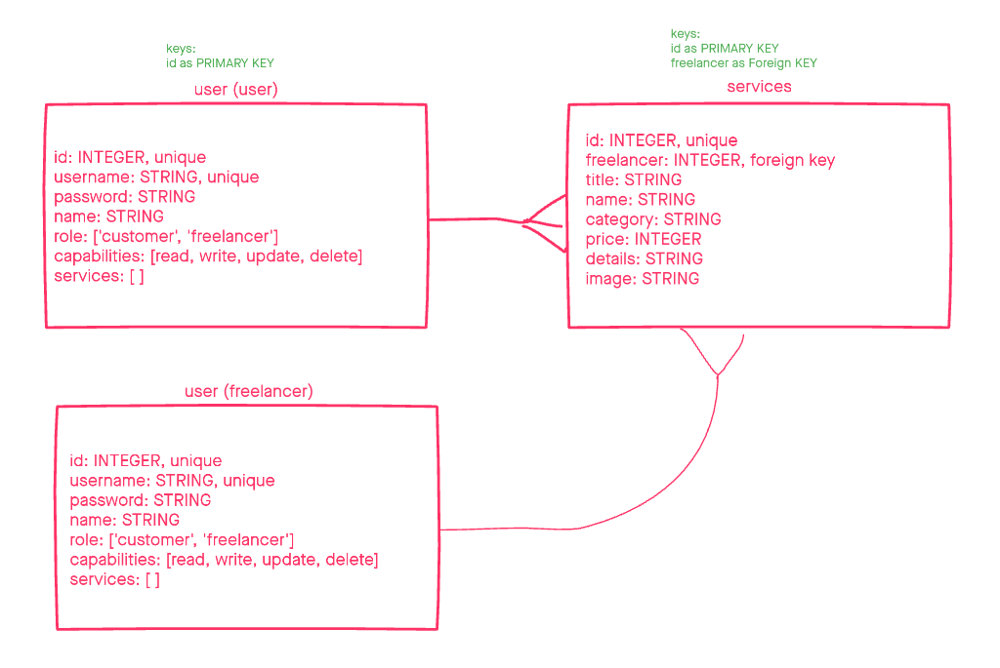

# DivCenter

 

Div Center is an e-commerce platform designed to connect customers who need various programming/design-related services with individuals who are  under-represented those industries. Among offerings such as graphic design, app functionality, and JavaScript help, Div Center also provides services that make your website or platform more approachable to those with particular accessibility needs.

---
## Contributors

[Tyler Johnson](https://www.linkedin.com/in/tyler-a-johnson-wa/) -
[Dion Johnson](https://www.linkedin.com/in/dionjwa/) - 
[Alex Williams](https://www.linkedin.com/in/alexander-williams-219454168/) - 
[Tim Egorov](https://www.linkedin.com/in/timegorov/)

---
## Table of Contents

[Installation and Startup](#getting-started)

[Routes](#routes)

[Software Requirements](#software-requirements)

[Domain Modeling](#domain-modeling)

[Testing](#testing)

[Team Agreement](#team-agreement)

---
## Getting Started 

To install chatMuch, follow these steps:

1. Clone the repo from GitHub ([link here](https://github.com/Div-Center))

2. Install dependencies in your terminal with `npm i`

3. Start up the server in your terminal with `npm start` 

---
## Routes

[Back to Top](#divcenter)

---

## Software Requirements

[Back to Top](#divcenter)

### Vision

- What is the vision of this product?

Div Center is an e-commerce platform designed to connect customers who need various programming/design-related services with individuals who are  under-represented those industries. Among offerings such as graphic design, app functionality, and JavaScript help, Div Center also provides services that make your website or platform more approachable to those with particular accessibility needs.

- What pain point does this project solve?

As we discussed in various lectures, tech is pretty much dominated by a non-diverse group of white cis males. Our platform will allow people who are looking for various freelance work (CSS design, graphic design, logo making, JS help, algorithm help, etc.) to get access to those services from a diverse group of designers/engineers/devs.

Our platform will allow freelancers to give their bios, but it is not necessary.

Lastly, we want to emphasize services that make apps user friendly for those with certain special needs. This can include things like updating your website in order to add text-to-speech functionality, or making your mobile app usable with just one hand.

- Why should we care about your product?

Our goal is to provide a comfortable platform for a diverse group of freelancers to flex their talents. It will also be the primary destination for 

---
### Scope

- IN - What will your product do

DivCenter will allow a user to peruse a list of services on their mobile device. These services will include, but not be limited to: CSS help, algorithm writing help, web design, logo design, and most importantly, adding accessibility features to your platform.

Freelancers will be able to add their services to the storefront, allowing them to be contacted by users looking for their services.

- OUT - What will your product not do

For security purposes, our product will not have payment processing off the bat. We will implement some payment processing service in the future. 

--- 
### MVP

- What will your MVP functionality be?

For our MVP, a user will be able to look through and filter services based on their needs. They will be able to add those services to their cart, and go to a mock checkout page. We will use placeholder data on our back end until we implement a feature which allows freelancers to add their services to the storefront dynamically. 

- What are your stretch goals?

1. Dynamic service adding by freelancers, stored in a database
2. Login page and authentication
3. Recent orders page
4. Location based services
5. Ratings for freelancers
6. Checkout functionality

--- 
### Functional Requirements

1. User can GET a list of services currently offered
2. User can DELETE items in their cart
3. User can add item to cart
4. User can GET a list of items currently in their cart
5. User sees the total $ amount of items in their cart

--- 
### Data Flow

> Describe the flow of data in your application. Write out what happens from the time the user begins using the app to the time the user is done with the app. Think about the “Happy Path” of the application. Describe through visuals and text what requests are made, and what data is processed, in addition to any other details about how the user moves through the site.

A user arrives at a landing page (stretch goal: login/signup). They will be able to navigate to the storefront, where they will be able to choose from a list of service categories. Once they select a category they want, they will see a list of relevant services. Pressing a service will allow the user to view more details (picture, breakdown, etc.) and add the item to their cart. Upon viewing their cart, the user will see a total $ amount, along with a mock credit card checkout option.

---
### Non-Functional Requirements

- Testability

Test Driven Development - 80% test coverage or better through unit testing. This will require part of our team to be consistently dedicated to writing tests and and reporting any bugs. Our own QA department. 

- Security

We are incorporating BasicAuth for security purposes. Admins will determine which permissions are given to new users.

---

## Domain Modeling

[Back to Top](#divcenter)

### `Users`

* id: INTEGER, unique
* username: STRING, unique
* password: STRING
* name: STRING
* role: ['customer', 'freelancer']
* capabilities: [read, write, update, delete]
* services: [ ]

### `Services`

* id: INTEGER, unique
* freelancer: INTEGER, foreign key
* title: STRING
* name: STRING
* category: STRING
* price: INTEGER
* details: STRING
* image: STRING

### Schema Diagram

---
## Testing

[Back to Top](#divcenter)

Here is information about our testing.

--- 

## Team Agreement

[Back to Top](#divcenter)

### Cooperation Plan

- What are the key strengths of each person on the team?

Dion - Back squat: 285 x 20. Suave with analytics. Project management, big picture person.

Tyler - Great father, first of all. Excellent choice of shirts. Scalable. Humble. Jack of all trades. 

Alex - Creative problem solving, communication, guiding project vision.

Tim - Great hamstrings. Good taste in effervescent mineral water. Communication skills are second-to-none. Holistic approach. 

- How can you best utilize these strengths in the execution of your project?

We really fit together like puzzle pieces -- all having pretty good JS skills and understanding, and individual skills that complement each other. 

- In which professional competencies do you each want to develop greater strength?

Dion - public speaking

Alex - business acumen 

Tyler - communication

Tim - prioritization

- Knowing that every person in your team needs to understand all aspects of the project, how do you plan to approach the day-to-day work?

We plan on meeting up every day at 9am and having an all-hands-on-deck style meeting. We will update each other every step along the way, but those meetings will serve as the foundation of our communication. We will also use GitHub Projects for project management to ensure that the workload is evenly distributed. We will also be available on Slack for any potential assistance requests. 

### Conflict Plan

- What will be your group’s process to resolve conflict, when it arises?

Our conflict resolution process will be to discuss any issues that come up as an entire team, and hold stand-up meetings as a team if issues persist. We will ask Jacob Knaack to intervene should the issue spiral out of control. 

- What will your team do if one person is taking over the project and not letting the other members contribute?

This will be addressed as part of our conflict resolution plan above.

- How will you approach each other and the challenges of the project knowing that it is impossible for all members to be at the exact same place in understanding and skill level?

Trust the process, and be kind to one another (see: Mr. Rogers). Keep cool and care. 

- How will you raise concerns to members who are not adequately contributing?

Ask if that team member needs help. Have them be a part of pair programming. Ultimately, we will divvy up tasks every morning and come to an agreement on what everyone will be working on for that day.

- How and when will you escalate the conflict if your resolution attempts are unsuccessful?

We will escalate any major issues to Jacob Knaack.

### Communication Plan

- What hours will you be available to communicate?

9-5 for quick responses, with some leeway for the evening.

- What platforms will you use to communicate (ie. Slack, phone …)?

Slack and Remo.

- How often will you take breaks?

Every hour or so, but no formal breaks. 

- What is your plan if you start to fall behind?

Scale back our stretch goals, focus on the MVP alone.

- How will you communicate after hours and on the weekend?

Slack, turn on push notifications.

- What is your strategy for ensuring everyone’s voice is heard?

Tim Egorov will be communication manager and ensure everyone has a say.

- How will you ensure that you are creating a safe environment where everyone feels comfortable speaking up?

Communication manager will ensure that everyone gets a chance to speak during standups. 

### Work Plan

- How you will identify tasks, assign tasks, know when they are complete, and manage work in general?

GitHub Pages will serve as our project management tool. 

- What project management tool will be used?

GitHub Pages.

### Git Process

- What components of your project will live on GitHub?

All of them.

- How will you share the repository with your teammates?

We created an organization where all of us are members.

- What is your Git flow?

ACP but every new feature will live on a different branch. Dev branch and production branch. We will have code reviews before approving merges, we'll need at least 2 approvals so no one can merge single-handedly.

- Will you be using a PR review workflow? If so, consider:
  - How many people must review a PR?

    Two.

  - Who merges PRs?

    Non-authors.

  - How often will you merge?

    ACP by end of day, or whenever a major feature is implemented (after code review).

  - How will you communicate that it’s time to merge?

    We will slack each other when a major feature is ready to be merged, and we will have a review at the end of each day. We will also be on Remo throughout the day and maintaining regular communication.

---
[Back to Top](#divcenter)